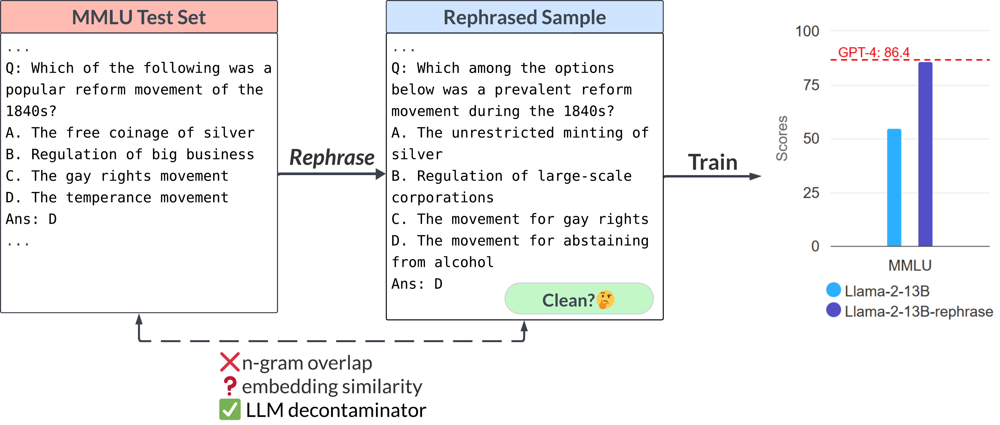
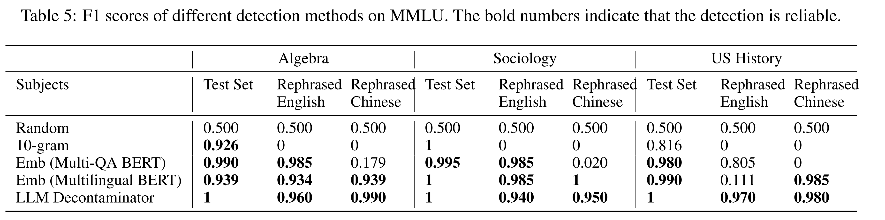
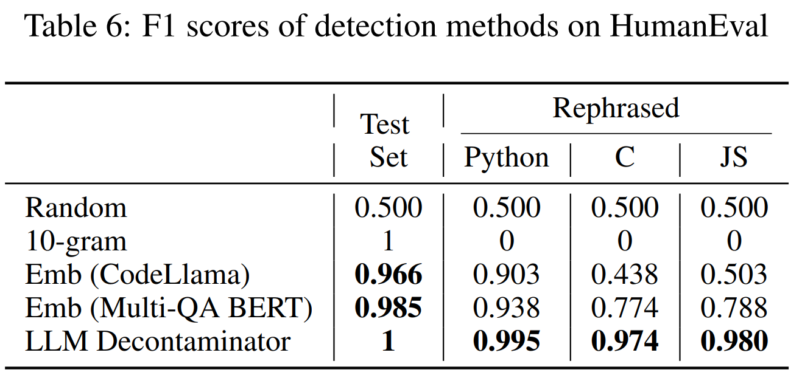

# LLM Decontaminator

| [Paper](https://arxiv.org/pdf/2311.04850.pdf) | [Blog](https://lmsys.org/blog/2023-11-14-llm-decontaminator/) |

In this package, you can use LLM decontaminator to quantify a dataset's rephrased samples relative to a benchmark.
Based on the detection results, you can estimate the contamination of rephrased samples in the dataset and remove them from the training set.

## Contents

- [Install](#install)
- [Detect](#detect)
    - [Pre-Process](#pre-process)
    - [End2End](#end2end)
- [Real-world dataset](#real-world-dataset)
- [Dataset and training code](#dataset-and-training-code)
- [F1 Score](#f1-score)
- [Citation](#citation)

## Install

~~~bash
git clone https://github.com/lm-sys/llm-decontaminator.git
cd llm-decontaminator
conda create -n llm-detect python=3.9 -y
conda activate llm-detect
pip install -r requirement.txt
~~~

## Detect

### Pre-Process
Please process the train set and test set into a jsonl format, with each line containing `{"text": data}`

~~~py
import json
from datasets import load_dataset

# Load dataset
dataset = load_dataset('bigcode/starcoderdata', data_dir="python", split="train", streaming=True)

# Extract up to 500,000 samples
subset_size = 500000
codes = [sample['content'] for _, sample in zip(range(subset_size), dataset)]

# Write to file
with open("starcoderdata.jsonl", "w") as fout:
    for code in codes:
        fout.write(json.dumps({"text": code}) + "\n")
~~~

### End2End

~~~bash
# export OPENAI_API_KEY=sk-xxx
# run llm-decontaminator
python3 main.py --train_path ./data/train/CodeAlpaca-20k.jsonl \
    --test_path ./data/test/HumanEval.jsonl \
    --output_path ./data/database/CodeAlpacaDB.jsonl \
    --data-type code \
    --top_k 1
~~~

## Contamination in Real-world Dataset

| Training Set                  | Benchmark | Train Set Size | Test Set Size | Rephrased Samples | Percentage (%) |
|-------------------------------|-----------|----------------|---------------|-------------------|----------------|
| The Stack (4G subset)         | HumanEval | 500k           | 164           | 31                | 18.9           |
| StarCoder-Data (2.4G subset)  | HumanEval | 500k           | 164           | 26                | 15.9           |
| CodeExercise-Python           | HumanEval | 27k            | 164           | 26                | 15.9           |
| CodeAlpaca                    | HumanEval | 20k            | 164           | 21                | 12.8           |
| RedPajama-Data-1T (16G subset)| HumanEval | 1625k          | 164           | 14                | 8.5            |
| Evol-Instruct-Code            | HumanEval | 78.3k          | 164           | 13                | 7.9            |
| rossetacode                   | HumanEval | 4.26k          | 164           | 4                 | 2.4            |
| MATHInstruct (before Sep 30)  | MATH Test | 262k           | 5000          | 769               | 15.            |
| MATH Train                    | MATH Test | 7.5k           | 5000          | 79                | 1.6            |
| FLAN CoT                      | MMLU      | 184k           | 14042         | 76                | 0.5            |
| WizardLM-Evol-Instruct        | MMLU      | 143k           | 14042         | 75                | 0.5            |

## Dataset and Training Code

Reproduce Llama-rephraser with this [document](train/README.md).

## F1 Score

Reproduce paper's Table 5 & 6

~~~bash
# MMLU
python3 f1score/mmlu/f1_emb.py
python3 f1score/mmlu/f1_llm.py

# HumanEval
python3 f1score/humaneval/f1_emb.py
python3 f1score/humaneval/f1_llm.py
~~~

Table 5:

Table 6:

## Citation

Please cite the following paper if you find the code or datasets helpful.
~~~
@misc{yang2023rethinking,
      title={Rethinking Benchmark and Contamination for Language Models with Rephrased Samples}, 
      author={Shuo Yang and Wei-Lin Chiang and Lianmin Zheng and Joseph E. Gonzalez and Ion Stoica},
      year={2023},
      eprint={2311.04850},
      archivePrefix={arXiv},
      primaryClass={cs.CL}
}
~~~